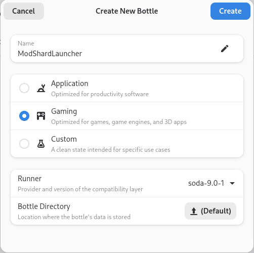

# Installing Mods

## Downloading ModShardLauncher

In order to install mods, you will require the **ModShardLauncher**.  
You can grab it on **Github** by clicking the button below.  

[ModShardLauncher :octicons-link-external-16:](https://github.com/DDDDDragon/ModShardLauncher/releases){ .md-button .md-button--primary}&emsp;

Make sure you download the `msl.zip` file, and ^^**not the source code**^^.  

Alternatively, you can build ModShardLauncher from source, but it's out of this guide's scope.

If launching MSL opens a console and closes immediately, you may require the **.NET Desktop Runtime 6.0**

[.NET Desktop Runtime 6.0 :octicons-link-external-16:](https://dotnet.microsoft.com/en-us/download/dotnet/6.0){ .md-button .md-button--primary}&emsp;

---

## Linux setup instructions

### Pre-requisites

- ***Bottles*** - https://usebottles.com/
- ***Stoneshard*** - The Windows version of Stoneshard must be used as the native Linux version is bundled differently

### Steps
1. Create a Bottle environment for gaming

2. Open the newly created bottle and click "Add Shortcut" and browse to then select the `ModShardLauncher.exe`
3. Modify the newly added item by clicking the three dot menu and going to "Change Launch Options".
The working directory must be updated to the directory that `ModShardLauncher.exe` resides in.
4. The bottle settings need to be updated to support the .NET environment. This can be found below the "Add Shortcut"
button, select "Settings" and then "Environment Variables". A new variable needs to be added to handle the
extraction location `DOTNET_BUNDLE_EXTRACT_BASE_DIR=Z:\home\{user}\dotnet_bundle_extract`, update this to a path of your choosing.

*If you run into file permission issues with Bottles this is due to it running in a flatpak.
I suggest using [Flatseal](https://flathub.org/apps/com.github.tchx84.Flatseal) to give Bottles access to the required paths.*
---

## ModShardLauncher Setup

???+ warning "IMPORTANT - Installing after RtR"
    Make sure you are on the `modbranch` beta of Stoneshard on Steam before proceeding below.  
    When launching the game, the version at the top right should say `X.X.X.X-vm`.  

    Here's how to do it :  
    - Right click on Stoneshard in your library on steam.  
    - Click `Properties`.  
    - Go in the `Betas` tab.  
    - Select the `modbranch` beta.  
    - Steam will now update your game files, when it's done, proceed below.

- **Extract** `ModShardLauncher.zip` anywhere.
- **Rename** `data.win` to `vanilla.win`  in your Stoneshard folder.
- **Run** `ModShardLauncher.exe`.

---

## UI Tour

Let's take a quick tour of the UI to better know MSL.   

 {: style="width:50%"} 

The button on the top left of the window shows the button's name.   
The `Anvil` button below that leads to the `Mods` menu. (***^^This is the only menu you will need^^***.)   
The `C#` button leads to the `Mod Sources` menu. (*It's used by modders to create their mods*.)   
The `Cog` button leads to the `Settings` menu. (*It's used for some settings you probably won't need*.)   

---

## Installing a Mod

Now that we've got MSL running, let's install some mods.  
Here's an [example video showing the installation](https://www.youtube.com/watch?v=_J0oJYGi38E&t=13s) of [NeoConsole](https://github.com/Nylux/Stoneshard-NeoConsole/releases). (*enable the subtitles !*)    
Note: It's a bit outdated, but the process is pretty much the same, a new video will be made at some point.  

???+ warning "MAKE SURE YOU ARE ON THE MODBRANCH BETA OF STONESHARD ON STEAM"

- Close MSL.
- Download your mod's `.sml` file.
- Place the `.sml` file in MSL's `Mods` folder.
- Start MSL.
- Click on the **anvil button** to open the `Mods` menu.
- At the top left of the window, click on the **folder button**.
- Select the `vanilla.win` file in the `Stoneshard` folder
- In the `Mods` menu, **tick the box** next to the mods you wish to enable.
- Click on the **save button** and save under any name (eg. `modded.win`)
- Close MSL.
- Start **Stoneshard**. It should ask you to select a `.win` file.
- Select the `modded.win` file and enjoy your mods !

  
