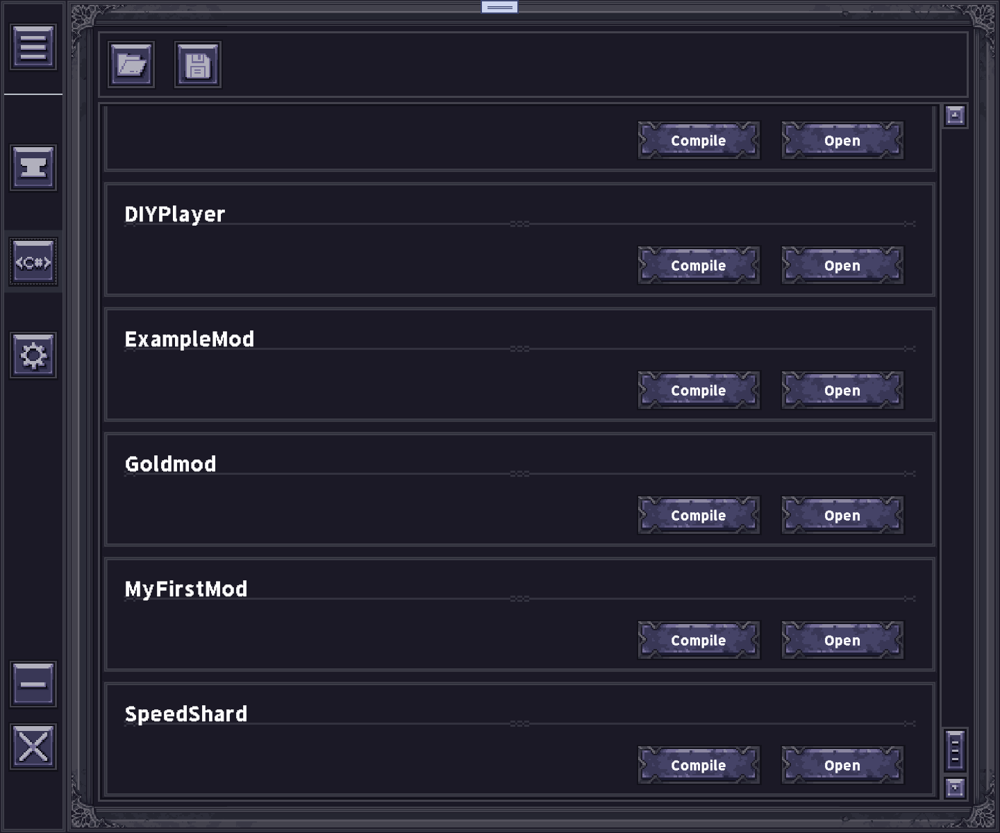

# So how can I play mod with this tool?

[TOC]

## Download it

You should download **ModShardLauncher** in the github page first. 
[Just here](https://github.com/DDDDDragon/ModShardLauncher/releases)

After you download it, you should run this tool once to load something.

If you run it successfully, you can find two new folders in this tool's path. They are Mods and ModSources.

Then let's have a look with the tool itself.

## Tool UI

First, I will introduce the buttons on the left side.

The top one is the Menu Button, click this button can show what the other buttons mean, like this:

Then the second button, Mods Button direct to a new page which can show you all the mods you have now, like this:

the test version speed shard mod and i draw a icon for it

The third button is ModSources Button, it shows all the sources code of mods for modders.

And the last one is Settings Button, it directs to the settings page.

## Patch mod

Then we can patch the mods we want into the game file.

First, you should go to the Mods page and select which mod you want to patch into the game. Just select the enable box under the mod bar. Don't forget to make sure that the mod's game version is the same as yours.

Second, click the first button on the top of this page, just the one looks like a folder icon. Then select a original edition of game file(data.win).

You'd better move your game file(data.win) to another place to make sure you have a original edition forever.

??? reason "Why vanilla file?"

    This tool works based on the names of objects in data.win file

??? reason "Why loading game file before compiling?"

    To access the right game virsion, and prevent the little chance of collapse if the game crashes when loading a different version.

After the loading box disappear, you can start next step.

Click the second button which seems like a save icon, then select the game's root path to save the patched game file.

The last step, move the ModShard.dll file in this tool's root path to the game's root path. It's an inner extension of this tool. Otherwise you can't launch the game. 

## Launch your game!

After launching the game, there is a new window that is opened by the extension. It is a control pannel that runs some inner script in game. If you see this, that means mods have been patched into your game.