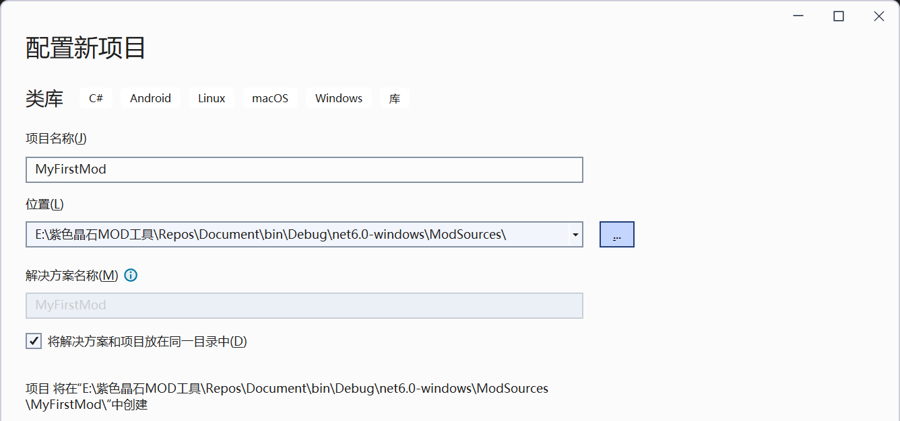
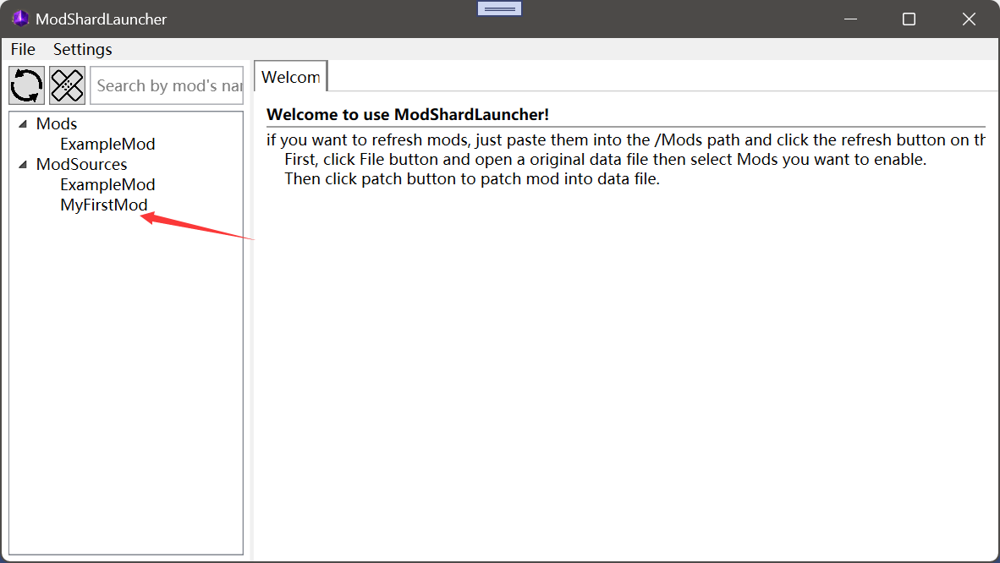
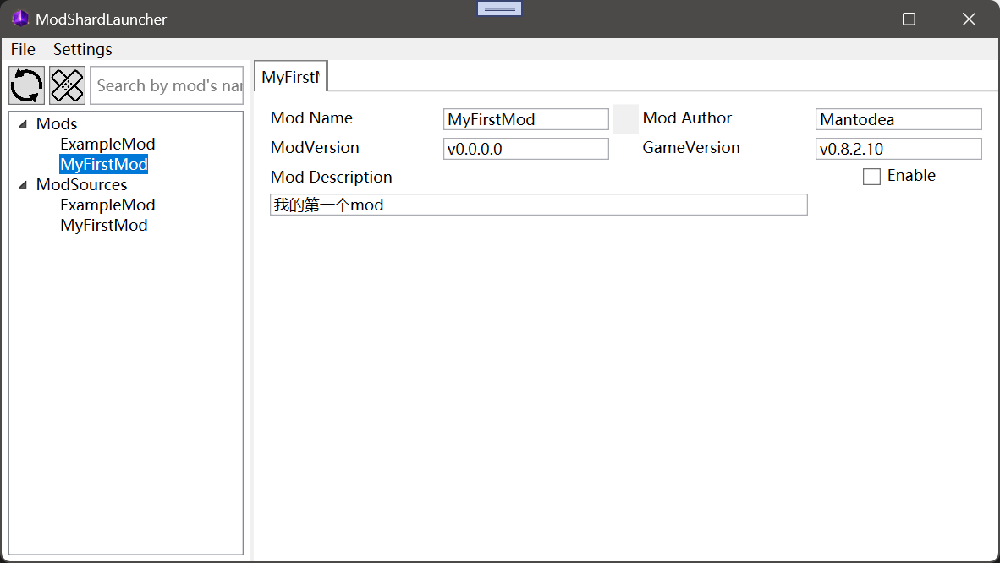

# 开始吧!

## C#基础

如果你想要制作mod, 那请确保你有一定的C#基础, 不然你可能会看不懂工具的API是怎么用的.

## 下载工具

要想制作mod, 你首先需要一个写代码的工具.

比如**Visual Studio**, 这是一款很专业的开发工具, 你可以用它方便地开发mod.

[在这里下载](https://visualstudio.microsoft.com/)

在下载时, 确保你选择了 `.NET Desktop Development` 工作负载. 其他的负载可以不用下载.

最后, 到微软官网查找 `.NET 6.0 SDK` 来下载安装包. 然后重启你的电脑来应用这些更改.

另一个选择是**Visual Studio Code**, 在我看来其实用VSCode就足以制作StoneShard的mod了. 但是我们此处先不详细叙述.

## 创建你的第一个mod

首先, 你需要启动 **ModShardLauncher.exe** , 启动之后它会在根目录下创建两个文件夹,
一个是Mods, 另一个是ModSources.

然后在ModSources文件夹中创建一个新的文件夹, 你的第一个mod就从这里开始了.

### 创建mod!

创建mod的方式有很多, 我们先来拿**Visual Studio**举例.
首先运行VS, 点击创建新项目, 搜索类库并单击下一步. 如图: 


然后输入你mod的名字, 选择路径为刚才 **ModShardLauncher.exe** 创建的 Mods 文件夹.


最后选择.Net 6.0即可


### 程序集引用!

首先我们需要引用工具的程序集, 即Dll文件.

先打开解决方案资源管理器.


右键依赖项, 并单击添加项目引用.


点击浏览.


最后选择ModShardLauncher.dll并点击添加.


### Mod主类!

如果你有C#基础, 那你一定对 **类**(Class) 有了解.我们接下来就要创建一个Mod的主类.

创建项目时, VS应该已经为我们创建了一个类, 名字叫做Class1. 我们要做的就是先添加对 `ModShardLauncher` 和 `ModShardLauncher.Mods` 这两个命名空间的引用. 然后将代码改成如下这样:


可以看到我们先是把类的访问级别从 `internal` 改为了 `public` , 这样一来Mod加载时就可以读取到这个类. 然后我们把类名改成了 `MyFirstMod` , 并让这个类继承 `Mod` 类.

### Mod信息!

接下来我们给Mod添加基础的信息.

在 `MyFirstMod` 类中添加如下代码:
```C#
public override string Name => "MyFirstMod";
public override string Author => "Mantodea";
public override string Description => "我的第一个mod";
```
这样我们就设置了mod的名称, 作者与描述信息.

### 编译Mod!

接下来我们启动**ModShardLauncher**.  可以看到我们的Mod源码已经被加载出来了.


在编译mod之前, 我们需要先点击左上角的File - Open, 并选择 **原版** 的data.win文件进行加载.

!!! 为什么要选择原版?
    这个工具是基于data.win文件内的各种信息的名称来工作的, 如果你已经加入了源码mod, 很可能会出现各种崩溃的情况.

!!! 为什么要加载游戏文件才能编译?
    为了获取游戏版本, 防止极小可能出现的版本不同而崩溃现象(确信)

然后我们就可以双击 `MyFirstMod` , 再点击编译辣! (我知道这个UI确实非常丑, 在改了在改了呜呜)

编译成功后的结果: 
